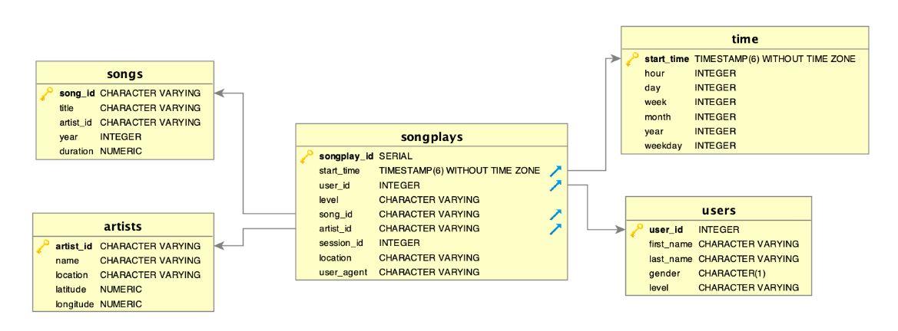

#  Data Lake: ETL with AWS S3 and Spark

[](https://travis-ci.org/joemccann/dillinger)

## Summary
- [Introduction](#Introduction)
- [The Goal](#The-Goal)
- [Tool](#Tool)
- [Database & ETL Pipeline](#Database-&-ETL-Pipeline)
- [How to Run](#How-to-Run)
- [Exmaple Queries](#Exmaple-Queries)
- [Code Explanations](#Code-Explanations)
***
### Introduction

Sparkify is a music streaming start-up company. The have collected many songs and user activities data through their 
music app. And the analytics team is particularly interested in understanding what songs users are listening to. 
Currently, their data resides in a directory of JSON logs on user activity on the app, as well as a directory with JSON 
metadata on the songs in their app. However, this cannot provid an easy way to query the data. 
***
### The Goal
The goal is to create a database schema and ETL pipeline for this analysis. The database and ETL pipeline will be 
tested by running queries given by the analytics team from Sparkify and compare results with their expected results.
***
### Tool
[AWS S3](https://aws.amazon.com/s3/): Customers of all sizes and industries can use it to store and protect any mount of data for a range of use cases, such as websites, mobile applications, backup and restore, archive, enterprise applications, IoT devices, and big data analytics. 

In this project, Song and Log data files are stored in a public ``S3 Buckets`` and the path is saved in the ``etl.py``.

In this project, one fact table and four dimension tables are created by using ``Spark`` and five parquets are saved in S3.

***
### Database & ETL Pipeline
Song and Log datasets are saved in AWS S3. A star schema is created including one fact table: **songplays**, and four dimension tables: **users**, **songs**, **artists** and **time**. A pipeline is built to transfer data from S3 tables to 5 above tables then saved in S3 bucket. 

The schema is shown as below:


***
### How to Run
1. Fill access configuration info into ```dl.cfg```
2. Run Following commands
```sh
$ python etl.py
```
3. Go to the output path to check the output files


***
### Code Explanations

**etl.py**: extract song and log data from S3 then select required columns to make 5 tables and finally saved into S3 bucket.

**dl.cfg:** configuration files containing info on access key